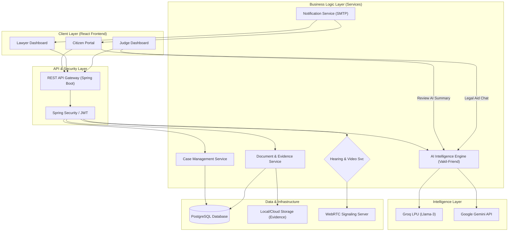

# NYAY-SETU 🏛️

**The Future of AI-Powered Digital Judiciary in India**

*Democratizing Justice. Empowering Citizens. Streamlining Courts.*

[]()
[]()
[]()

---

## 📋 Table of Contents

- [Overview](#overview)
- [Key Features](#key-features)
- [Architecture](#architecture)
- [Technology Stack](#technology-stack)
- [Quick Start](#quick-start)
- [Project Structure](#project-structure)
- [Environment Setup](#environment-setup)
- [API Documentation](#api-documentation)

---

## �️ Project Vision

**NyaySetu** is a revolutionary digital platform designed to bridge the gap between Indian citizens and the judiciary. By combining high-performance AI (Groq) with a deep understanding of Indian law, we provide a unified ecosystem for legal aid, case management, and judicial efficiency.

### High-Performance AI (Groq Integration)
We have migrated our core intelligence from Gemini to **Groq LPU**, ensuring lightning-fast responses for legal queries, document analysis, and procedural guidance.

---

## 🚀 Key Modules & Innovations

### 1. 🤖 Vakil-Friend (AI Legal Aid)
An intelligent legal companion that helps citizens understand their rights, verify documents, and prepare for filing.
- **Actionable Advice**: Guided chat flow for case filing.
- **Document Pre-verification**: AI-driven analysis of evidence before it reaches the court.
- **Bilingual Interface**: Seamless support for English and Hindi.

### 2. ⚖️ Judicial Efficiency Flow
A modernized approach to case distribution and management.
- **Unassigned Case Pool**: Judges can browse and "claim" cases from a transparent pool.
- **Automated Case Summary**: AI generates concise summaries for judges to speed up review.
- **Digital Evidence Locker**: Secure storage for all case-related documents.

### 3. 🤝 Legal Marketplace (Hire a Lawyer)
Connecting clients with vetted legal professionals.
- **Proposal System**: Clients can send hiring proposals directly to lawyers.
- **Lawyer Dashboard**: Professionals can manage their caseload and respond to potential clients.
- **Direct Integration**: Once hired, lawyers gain immediate access to the digital case file.

---

## 🏗️ Architecture & Technical Flow

The following diagram illustrates the high-level architecture and data flow of the NYAY-SETU platform, showcasing the interaction between the frontend, backend, AI services, and database.



---

## 🛠️ Technology Stack

| Layer | Technologies |
|-------|--------------|
| **Frontend** | React 18, Vite, Framer Motion, Vanilla CSS (Royal Blue Theme) |
| **Backend** | Spring Boot 3.2, Java 17, Spring Security (JWT) |
| **Database** | PostgreSQL, Flyway (Migration-based schema) |
| **AI Intelligence** | Groq (Llama-3-70B/8B), Azure Document Intelligence (Optional) |
| **Animations** | AOS, Three.js (Backgrounds) |

---

## 📂 Project Structure

```bash
NYAY-SETU/
├── backend/nyaysetu-backend/    # Spring Boot Enterprise Backend
│   ├── db/migration/           # Flyway scripts (Force-fix schema support)
│   ├── entity/                 # AI-enhanced JPA entities
│   └── service/                # Groq/AI & Judicial business logic
├── frontend/nyaysetu-frontend/  # Modern React Web Portal
│   ├── components/             # Role-specific dashboard components
│   └── pages/                  # Landing, AI Wizard, Constitution
└── docs/                       # Project documentation & Architecture
```

---

## 🚀 Quick Start (Local Development)

### Prerequisites
- Java 17+
- Maven 3.6+
- Node.js 18+ and npm
- PostgreSQL 15+
- Groq API Key

### 1. Configure Environment
Create a `.env` file in `backend/nyaysetu-backend` (use `.env.example` as a template).

### 2. Initialize Database
Create a database named `nyaysetu`. Flyway will automatically handle the schema creation including the new base schema.

### 3. Run Backend
```bash
cd backend/nyaysetu-backend
mvn spring-boot:run
```

### 4. Run Frontend
```bash
cd frontend/nyaysetu-frontend
npm install
npm run dev
```

---

## 📁 Project Structure

```
NYAY-SETU/
├── backend/
│   ├── nyaysetu-backend/           # Main Spring Boot application
│   │   ├── src/main/java/com/nyaysetu/backend/
│   │   │   ├── controller/         # 14 REST controllers
│   │   │   ├── service/            # 14 business services
│   │   │   ├── repository/         # 16 JPA repositories
│   │   │   ├── entity/             # 21 JPA entities
│   │   │   ├── dto/                # 32 data transfer objects
│   │   │   ├── config/             # Security, CORS config
│   │   │   ├── filter/             # JWT filter
│   │   │   ├── exception/          # Error handling
│   │   │   ├── notification/       # Email service
│   │   │   └── util/               # Utilities
│   │   ├── src/main/resources/
│   │   │   └── application.properties
│   │   └── pom.xml
│   ├── pom.xml                     # Parent POM (multi-module)
│   └── uploads/                    # File storage
│
├── frontend/
│   └── nyaysetu-frontend/
│       ├── src/
│       │   ├── components/
│       │   │   ├── landing/        # Landing page components
│       │   │   ├── auth/           # Login/Signup
│       │   │   ├── case/           # Case management
│       │   │   ├── document/       # Document viewer
│       │   │   ├── common/         # Shared components
│       │   │   ├── ErrorBoundary.jsx
│       │   │   └── LoadingSpinner.jsx
│       │   ├── pages/
│       │   │   ├── Landing.jsx
│       │   │   ├── About.jsx
│       │   │   ├── Constitution.jsx
│       │   │   ├── Login.jsx
│       │   │   ├── Signup.jsx
│       │   │   └── dashboards/     # Role-specific dashboards
│       │   ├── contexts/
│       │   │   └── LanguageContext.jsx
│       │   ├── services/
│       │   │   └── api.js          # Axios client
│       │   ├── store/
│       │   │   └── authStore.js    # Zustand store
│       │   ├── styles/
│       │   │   ├── global.css
│       │   │   └── responsive.css
│       │   ├── App.jsx
│       │   └── main.jsx
│       ├── package.json
│       └── vite.config.js
│
├── .env                            # Environment variables (git-ignored)
├── .gitignore                      # Git ignore rules
└── README.md                       # This file
```

---

## 🔧 Environment Setup

### Required Environment Variables

| Variable | Description | Example |
|----------|-------------|---------|
| `DB_USERNAME` | PostgreSQL username | `nyaysetu` |
| `DB_PASSWORD` | PostgreSQL password | `your_password` |
| `JWT_SECRET` | JWT signing key (256-bit) | `your-secret-key` |
| `GEMINI_API_KEY` | Google Gemini API key | `AIza...` |
| `CORS_ALLOWED_ORIGINS` | Allowed origins for CORS | `http://localhost:5173` |
| `SMTP_USERNAME` | Email for notifications | `your-email@gmail.com` |
| `SMTP_PASSWORD` | Email app password | `your-app-password` |

### Getting API Keys

**Google Gemini API** (Free tier available):
1. Visit: https://aistudio.google.com/app/apikey
2. Create new API key
3. Add to `.env` as `GEMINI_API_KEY`
4. Free quota: 15 requests/minute, 1500 requests/day

---

## 🛡️ Security & Ethics
- **Human-in-the-Loop**: AI provides guidance; Judges provide judgment.
- **Data Privacy**: End-to-end encryption for legal documents.
- **Immutable Logs**: Audit trailing for every case status change.

---

## 🎨 Design System

### Color Palette
- **Primary**: Royal Blue (#2563eb)
- **Secondary**: Purple (#8b5cf6)
- **Accent**: Pink (#ec4899)
- **Background**: Dark (#0f172a)
- **Text**: White (#ffffff), Gray (#94a3b8)

### Typography
- **Font**: System fonts (San Francisco, Segoe UI, etc.)
- **Headings**: 900 weight, gradient text
- **Body**: 400-600 weight

### Animations
- **Framer Motion** for page transitions
- **AOS** for scroll animations
- Spring physics for smooth interactions

---

## 🔒 Security Features

- ✅ JWT token authentication
- ✅ Password encryption (BCrypt)
- ✅ SQL injection protection (JPA)
- ✅ XSS protection
- ✅ CORS configuration
- ✅ Audit logging
- ✅ Role-based access control

---

## 📊 Current Status

### Completed ✅
- Monolith backend architecture
- Full authentication system
- Case management module
- Document management
- Meeting scheduling
- AI chatbot integration (Gemini)
- Modern responsive frontend
- Bilingual support (EN/HI)
- Error handling & loading states
- Interactive Constitution browser

### In Progress 🔄
- Full 470 Constitution articles
- WebRTC video conferencing
- Advanced AI features (RAG, semantic search)

### Planned 📋
- Mobile app (React Native)
- Offline support (PWA)
- Blockchain audit trail
- E-signature integration
- Analytics dashboard

---

## 🤝 Contributing

1. Fork the repository
2. Create feature branch: `git checkout -b feature/name`
3. Commit changes: `git commit -m "feat: description"`
4. Push to branch: `git push origin feature/name`
5. Create Pull Request

**Commit Convention**: Follow [Conventional Commits](https://conventionalcommits.org/)

---

## 📄 License

Proprietary software. All rights reserved.

---

---

## 👨‍💻 Author & Visionary
**Virendra Gadekar**
[GitHub](https://github.com/viru0909-dev) | [LinkedIn](https://linkedin.com/in/virendra-gadekar)

---
*Built with ❤️ for a more accessible Indian Judiciary.*

*Last Updated: December 20 2025*
