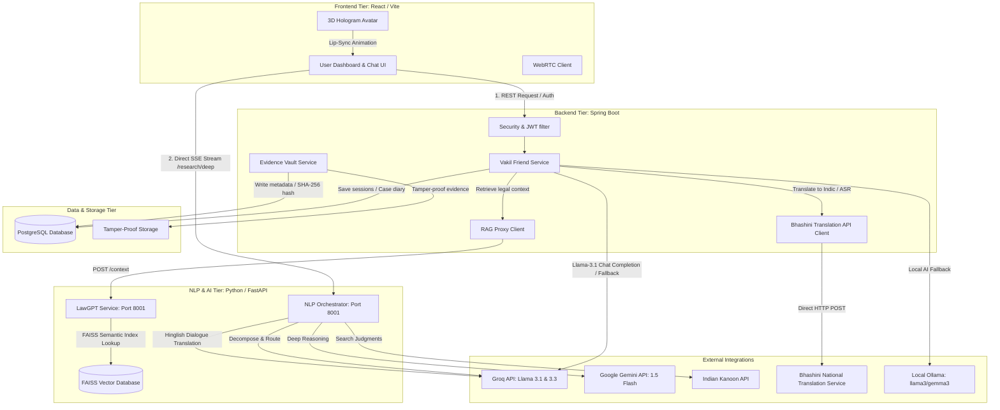
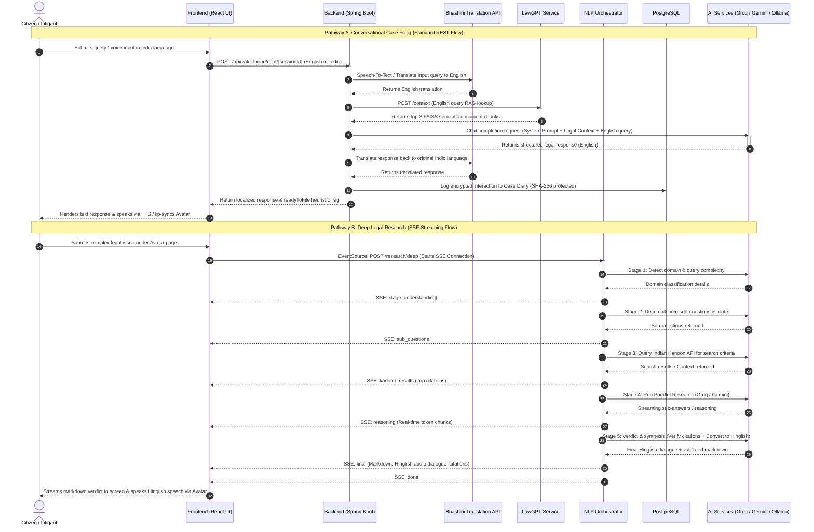

<p align="center">
  
</p>

<p align="center">
  <a href="https://nyaysetu-lovat.vercel.app/">
    
  </a>
  &nbsp;
  <a href="https://github.com/viru0909-dev/nyay-setu-working/issues">
    
  </a>
  &nbsp;
  <a href="https://github.com/viru0909-dev/nyay-setu-working/pulls">
    
  </a>
  &nbsp;
  <a href="https://github.com/viru0909-dev/nyay-setu-working/stargazers">
    
  </a>
</p>

<p align="center">
  <em>Democratizing Access to Justice Through Artificial Intelligence</em>
</p>

<hr/>

> **Mission Statement**
>
> India has over 50 million pending court cases. Millions of citizens cannot afford legal counsel. Nyay Setu bridges this gap by putting an AI-powered legal assistant, end-to-end case management, and secure virtual courts in the hands of every Indian — entirely free of charge.

<hr/>

## Table of Contents

- [Why Nyay Setu?](#why-nyay-setu)
- [Key Features](#key-features)
- [Tech Stack](#tech-stack)
- [System Architecture & Data Flow](#system-architecture--data-flow)
- [Quick Start](#quick-start)
- [Documentation](#documentation)
- [Contributing](#contributing)
- [Contributors](#contributors)
- [License](#license)

<hr/>

## Why Nyay Setu?

The Indian judiciary faces a systemic crisis that affects hundreds of millions of citizens:

| Problem | Scale |
|---|---|
| Pending court cases | **50+ Million** |
| Average time to resolve a civil case | **10–15 Years** |
| Citizens unable to afford legal representation | **Hundreds of Millions** |

Nyay Setu is built to address this directly. The platform removes the three biggest barriers to legal access — cost, complexity, and distance — by digitizing the entire judiciary workflow and placing an AI legal assistant at every citizen's fingertips.

<hr/>

## Key Features

**AI Legal Assistant (Vakil Friend)**
A conversational AI companion powered by Groq's Llama 3.1 that helps citizens understand their legal rights, navigate case filings, review documents, and get real-time answers in plain, accessible language.

**Role-Based Dashboards**
Secure, tailored portals for every user type in the legal ecosystem: Litigants, Lawyers, Judges, Police, and Administrators — each with a workflow designed around their specific responsibilities.

**End-to-End Case Management**
Full case lifecycle support from initial filing to final order, including a case diary, hearing timelines, document management, and status tracking.

**Evidence Vault**
Structured digital evidence uploads with SHA-256 hash verification, creating a tamper-proof and legally admissible record for every case.

**Digital FIR Handling**
Police can upload FIRs digitally. The AI instantly generates a structured summary and draft charge sheet, significantly reducing manual paperwork and processing time.

**Virtual Courtrooms**
Native WebRTC-based video conferencing integrated directly into the case timeline for secure, seamless remote hearings — no third-party applications required.

**Secure Authentication**
JWT-based stateless authentication with Spring Security, role-based access control, and multi-layer request filtering.

<hr/>

## Tech Stack

<p align="center">
  
  
  
  
  
  
  
  
  
  
  
  
</p>

<hr/>

## Project Structure

```text
nyay-setu-working/
│
├── frontend/                        # React + Vite frontend application
│   └── nyaysetu-frontend/           # Main frontend source code
│       ├── src/
│       │   ├── components/          # Reusable UI components
│       │   ├── pages/               # Application pages/routes
│       │   ├── services/            # API service handlers
│       │   ├── hooks/               # Custom React hooks
│       │   ├── store/               # Zustand/global state management
│       │   ├── utils/               # Helper and utility functions
│       │   └── assets/              # Images, icons, and static assets
│       ├── public/                  # Public static files
│       └── package.json             # Frontend dependencies and scripts
│
├── backend/                         # Spring Boot backend services
│   └── nyaysetu-backend/
│       ├── src/main/java/           # Main backend application source
│       ├── src/main/resources/      # Configuration files and resources
│       ├── src/test/                # Backend test cases
│       └── pom.xml                  # Maven configuration
│
├── nlp-orchestrator/                # FastAPI-based NLP orchestration service
│   ├── main.py                      # Main FastAPI application entry point
│   ├── services/                    # NLP and AI processing services
│   ├── routes/                      # API route handlers
│   ├── models/                      # AI/NLP models and schemas
│   └── requirements.txt             # Python dependencies
│
├── docs/                            # Project documentation
│   ├── architecture/                # Architecture and system design docs
│   ├── setup.md                     # Setup and installation guide
│   └── additional-guides/           # Supporting documentation
│
├── assets/                          # README banners, screenshots, and assets
│
├── .github/                         # GitHub workflows and community files
│   ├── workflows/                   # CI/CD GitHub Actions workflows
│   └── ISSUE_TEMPLATE/              # GitHub issue templates
│
├── CONTRIBUTING.md                  # Contribution guidelines
├── README.md                        # Main project documentation
├── LICENSE                          # Open-source license
└── SYSTEM_DOCUMENTATION.md          # API and system documentation
```

### Directory Overview

| Directory | Purpose |
|---|---|
| `frontend/` | Contains the React frontend application and UI components |
| `backend/` | Handles APIs, authentication, database access, and business logic |
| `nlp-orchestrator/` | Manages AI-powered legal assistance and NLP workflows |
| `docs/` | Contains setup guides, architecture diagrams, and technical documentation |
| `assets/` | Stores README images, banners, and other static assets |
| `.github/` | GitHub workflows, templates, and repository automation |

## System Architecture & Data Flow

Nyay Setu's architecture is a microservices ecosystem structured into three tiers:
1. **Frontend Tier (React + Vite)**: Renders role-based interactive dashboards, provides client-side WebRTC capabilities for virtual hearings, handles audio recording via browser APIs, and features a dynamic 3D Hologram Avatar component.
2. **Core Backend Tier (Spring Boot)**: Manages case creation, secure session handling, user credentials, document verification vaults (SHA-256 hashed), Bhashini Indic language services integration, and routes conversational requests.
3. **NLP & AI Tier (FastAPI)**: Coordinates advanced legal reasoning pipelines, decompiles multi-part queries, executes parallel web research on Indian Kanoon databases, synthesizes citations, and converts final summaries to Hinglish dialogue.

### Component Architecture & Interactions


```mermaid
graph TD
    %% Define Nodes
    subgraph FrontendApp [Frontend Tier: React / Vite]
        UI[User Dashboard & Chat UI]
        AV[3D Hologram Avatar]
        RTC[WebRTC Client]
    end

    subgraph BackendApp [Backend Tier: Spring Boot]
        Auth[Security & JWT filter]
        VF_Svc[Vakil Friend Service]
        Doc_Svc[Evidence Vault Service]
        Bhash_Svc[Bhashini Translation API Client]
        RAG_Proxy[RAG Proxy Client]
    end

    subgraph NLP_AI [NLP & AI Tier: Python / FastAPI]
        NLP_Orch[NLP Orchestrator: Port 8001]
        L_GPT[LawGPT Service: Port 8001]
        FAISS[(FAISS Vector Database)]
    end

    subgraph DatabaseTier [Data & Storage Tier]
        DB[(PostgreSQL Database)]
        Vault[Tamper-Proof Storage]
    end

    subgraph ExtAPIs [External Integrations]
        Groq[Groq API: Llama 3.1 & 3.3]
        Gemini[Google Gemini API: 1.5 Flash]
        Kanoon[Indian Kanoon API]
        Bhashini[Bhashini National Translation Service]
        Ollama[Local Ollama: llama3/gemma3]
    end

    %% Interactions
    UI -->|1. REST Request / Auth| Auth
    UI -->|2. Direct SSE Stream /research/deep| NLP_Orch
    AV -->|Lip-Sync Animation| UI

    Auth --> VF_Svc
    VF_Svc -->|Save sessions / Case diary| DB
    Doc_Svc -->|Write metadata / SHA-256 hash| DB
    Doc_Svc -->|Tamper-proof evidence| Vault

    VF_Svc -->|Retrieve legal context| RAG_Proxy
    RAG_Proxy -->|POST /context| L_GPT
    L_GPT -->|FAISS Semantic Index Lookup| FAISS

    VF_Svc -->|Translate to Indic / ASR| Bhash_Svc
    Bhash_Svc -->|Direct HTTP POST| Bhashini

    VF_Svc -->|Llama-3.1 Chat Completion / Fallback| Groq
    VF_Svc -->|Local AI Fallback| Ollama
    
    NLP_Orch -->|Decompose & Route| Groq
    NLP_Orch -->|Deep Reasoning| Gemini
    NLP_Orch -->|Search Judgments| Kanoon
    NLP_Orch -->|Hinglish Dialogue Translation| Groq
```

### Request and Response Data Flow Sequence

The system supports two primary request handling paradigms. The sequence diagram below shows both the standard conversational filing path (JWT-secured REST via Spring Boot) and the advanced deep legal research pipeline (direct client SSE connection to Python NLP-Orchestrator).


```mermaid
sequenceDiagram
    autonumber
    actor User as Citizen / Litigant
    participant FE as Frontend (React UI)
    participant BE as Backend (Spring Boot)
    participant BHA as Bhashini Translation API
    participant GPT as LawGPT Service
    participant NLP as NLP Orchestrator
    participant DB as PostgreSQL
    participant AI as AI Services (Groq / Gemini / Ollama)

    %% Session A: Conversational Filing Flow
    Note over User, AI: Pathway A: Conversational Case Filing (Standard REST Flow)
    User->>FE: Submits query / voice input in Indic language
    FE->>BE: POST /api/vakil-friend/chat/{sessionId} (English or Indic)
    activate BE
    BE->>BHA: Speech-To-Text / Translate input query to English
    BHA-->>BE: Returns English translation
    BE->>GPT: POST /context (English query RAG lookup)
    activate GPT
    GPT-->>BE: Returns top-3 FAISS semantic document chunks
    deactivate GPT
    BE->>AI: Chat completion request (System Prompt + Legal Context + English query)
    activate AI
    AI-->>BE: Returns structured legal response (English)
    deactivate AI
    BE->>BHA: Translate response back to original Indic language
    BHA-->>BE: Returns translated response
    BE->>DB: Log encrypted interaction to Case Diary (SHA-256 protected)
    BE-->>FE: Return localized response & readyToFile heuristic flag
    deactivate BE
    FE-->>User: Renders text response & speaks via TTS / lip-syncs Avatar

    %% Session B: Deep Legal Research Flow
    Note over User, AI: Pathway B: Deep Legal Research (SSE Streaming Flow)
    User->>FE: Submits complex legal issue under Avatar page
    FE->>NLP: EventSource: POST /research/deep (Starts SSE Connection)
    activate NLP
    NLP->>AI: Stage 1: Detect domain & query complexity
    AI-->>NLP: Domain classification details
    NLP-->>FE: SSE: stage [understanding]
    NLP->>AI: Stage 2: Decompile into sub-questions & route
    AI-->>NLP: Sub-questions returned
    NLP-->>FE: SSE: sub_questions
    NLP->>AI: Stage 3: Query Indian Kanoon API for search criteria
    AI-->>NLP: Search results / Context returned
    NLP-->>FE: SSE: kanoon_results (Top citations)
    NLP->>AI: Stage 4: Run Parallel Research (Groq / Gemini)
    AI-->>NLP: Streaming sub-answers / reasoning
    NLP-->>FE: SSE: reasoning (Real-time token chunks)
    NLP->>AI: Stage 5: Verdict & synthesis (Verify citations + Convert to Hinglish)
    AI-->>NLP: Final Hinglish dialogue + validated markdown
    NLP-->>FE: SSE: final (Markdown, Hinglish audio dialogue, citations)
    NLP-->>FE: SSE: done
    deactivate NLP
    FE-->>User: Streams markdown verdict to screen & speaks Hinglish speech via Avatar
```

<hr/>

## API Versioning Strategy

This project implements a robust API versioning strategy starting from `v1`. 
- The stable release of our APIs is accessible under the `/api/v1/` prefix.
- A global `WebMvcConfigurer` automatically prefixes all backend controllers. 
- Any future breaking changes will be introduced under a new version (e.g., `/api/v2/`), ensuring backward compatibility for existing client applications.

## Quick Start

For complete setup instructions, environment configuration, and Docker deployment details, refer to the **[Detailed Setup Guide](./docs/setup.md)**.

At a high level, the platform consists of three services that need to run concurrently:

| Service | Directory | Command |
|---|---|---|
| Frontend | `frontend/nyaysetu-frontend/` | `npm install && npm run dev` |
| Backend | `backend/nyaysetu-backend/` | `mvn spring-boot:run` |
| NLP Orchestrator | `nlp-orchestrator/` | `uvicorn main:app --reload` |

> **Prerequisites:** Node.js >= 20, Java 17, Maven 3.9+, PostgreSQL 15+, Python 3.12+

For environment variables, copy `.env.example` to `.env` and fill in your values. A full reference of all required variables is documented in the [Setup Guide](./docs/setup.md#environment-variables).

<hr/>

## Documentation

| Document | Description |
|---|---|
| [Setup Guide](./docs/setup.md) | Full database setup, environment variables, and Docker configuration |
| [Architecture Overview](./docs/architecture/overview.md) | System design, component diagrams, and data flow |
| [AI Integration Guide](./AI_INTEGRATION_GUIDE.md) | Groq API and NLP orchestrator technical deep-dive |
| [API Documentation](./SYSTEM_DOCUMENTATION.md) | All REST endpoints with request and response specifications |
| [Contributing Guidelines](./CONTRIBUTING.md) | Branching strategy, commit conventions, and PR workflow |

<hr/>

## Contributing

This project is part of **GSSoC (GirlScript Summer of Code) 2026**. Contributions are welcome from everyone, regardless of experience level.

**Before opening a Pull Request:**

| Requirement | Details |
|---|---|
| Read the guidelines | Review [CONTRIBUTING.md](./CONTRIBUTING.md) for our branching and commit conventions |
| Link an issue | Every PR must reference the issue it closes (`Closes #123`) |
| Include visuals | UI-affecting PRs must include screenshots or a screen recording |
| Sync with main | Rebase or merge `main` into your branch before requesting review |
| Pass all checks | CI checks for lint, tests, and build must all pass |

Browse [open issues](https://github.com/viru0909-dev/nyay-setu-working/issues) and filter by `good first issue` to get started.

<hr/>

## Troubleshooting

### Common Setup Issues

#### 1. npm install fails
- Ensure Node.js version is `>= 20`
- Delete `node_modules` and reinstall dependencies:

```bash
rm -rf node_modules
npm install
```

---

#### 2. PostgreSQL connection issues
- Verify PostgreSQL service is running
- Check database credentials in `.env`
- Ensure database and user are created properly

---

#### 3. Java version mismatch
Verify Java version:

```bash
java -version
```

Ensure Java 17 is installed and configured correctly.

---

#### 4. Missing environment variables
- Copy `.env.example` to `.env`
- Fill all required variables before starting services

---

#### 5. Backend server not starting
- Ensure PostgreSQL is running
- Verify Maven installation:

```bash
mvn -version
```

- Check all dependencies are installed properly

---

#### 6. Port already in use
Stop conflicting processes or use different ports.

Example:

```bash
npx kill-port 3000
```

## Contributors

<br/>

<a href="https://github.com/viru0909-dev/nyay-setu-working/graphs/contributors">
  
</a>

<br/><br/>

This chart updates automatically as new contributors merge pull requests. Want to see your avatar here? [Pick up an issue](https://github.com/viru0909-dev/nyay-setu-working/issues) and start contributing.

<hr/>

## License

This project is licensed under the **MIT License**. See the [LICENSE](./LICENSE) file for the full license text and guidelines on bulk-adding license headers to all source files in the repository.

<hr/>

<p align="center">
  Built with purpose for a more accessible Indian Judiciary.<br/>
  <em>Nyay Setu — न्याय हर किसी का अधिकार है।</em>
</p>
