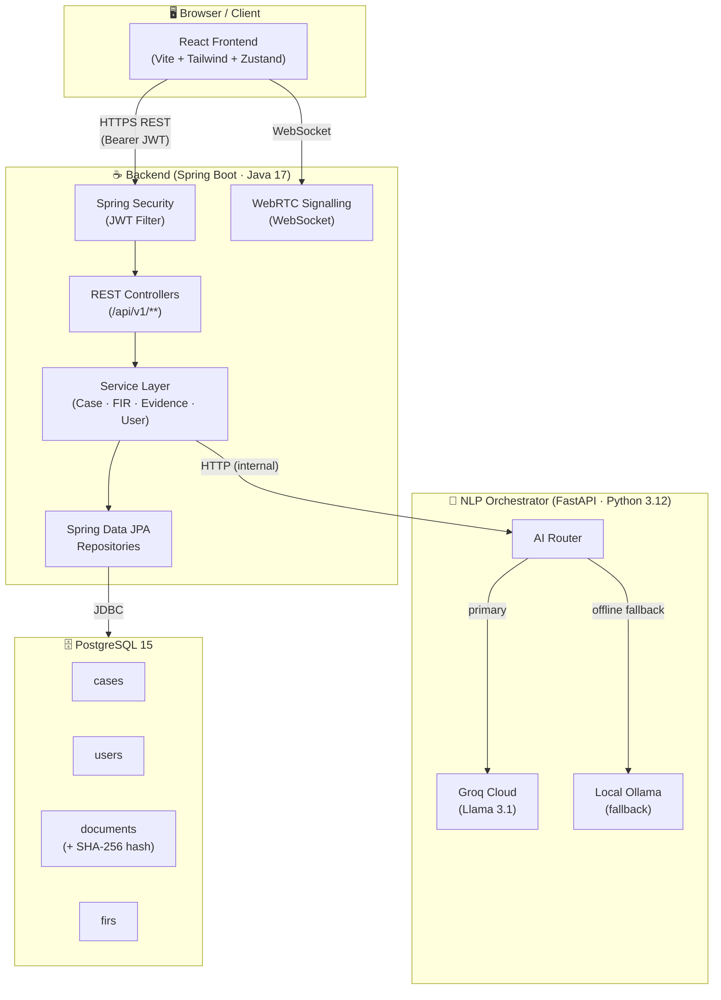
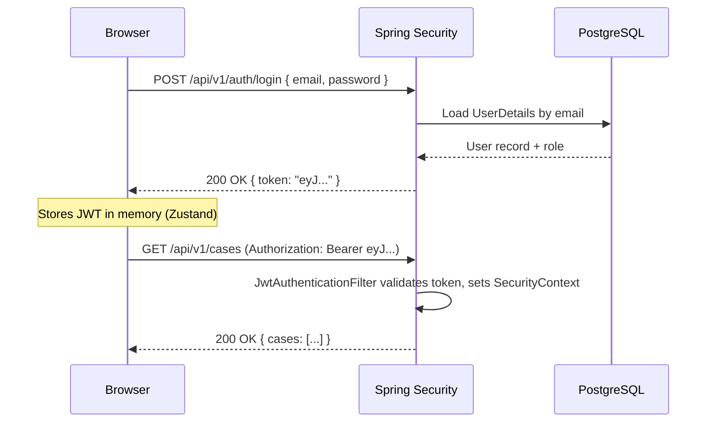

# Nyay Saarthi — Architecture Overview

> A contributor-focused guide to how the three services fit together.

---

## Table of Contents

- [System Overview](#system-overview)
- [Architecture Diagram](#architecture-diagram)
- [Service Breakdown](#service-breakdown)
  - [Frontend](#1-frontend-react--vite)
  - [Backend](#2-backend-spring-boot)
  - [NLP Orchestrator](#3-nlp-orchestrator-python--fastapi)
- [Data Flow Walkthrough](#data-flow-walkthrough)
- [Authentication Flow](#authentication-flow)
- [Key Files for New Contributors](#key-files-for-new-contributors)

---

## System Overview

Nyay Saarthi is composed of **three independently runnable services** that communicate over HTTP/REST and WebRTC:

| Service | Language / Runtime | Role |
|---|---|---|
| **Frontend** | React 18 + Vite + Tailwind | User-facing UI for all roles (Litigant, Lawyer, Judge, Police, Admin) |
| **Backend** | Java 17 + Spring Boot | Business logic, REST API, JWT auth, PostgreSQL persistence |
| **NLP Orchestrator** | Python 3.12 + FastAPI | AI routing layer — proxies requests to Groq (Llama 3.1) or local Ollama |

A browser client talks **only** to the Frontend and the Backend. The Backend talks to the NLP Orchestrator internally; the orchestrator is never exposed directly to the internet.

---

## Architecture Diagram



---

## Service Breakdown

### 1. Frontend (React + Vite)

**Directory:** `frontend/nyaysetu-frontend/`

The frontend is a single-page application. Global client state is managed by **Zustand**; all server state is fetched via plain `fetch` / Axios calls to the Spring Boot API.

**Role-based routing** is the core structural concept: after login the JWT payload contains the user's role, and the router renders a different dashboard shell (`/litigant`, `/lawyer`, `/judge`, `/police`, `/admin`).

Key responsibilities:
- Renders role-specific dashboards and workflows.
- Hosts the **Vakil Friend** chat widget (sends messages to `/api/v1/ai/chat` on the backend, which proxies to the NLP Orchestrator).
- Manages the **Virtual Courtroom** UI over a native WebRTC peer connection (signalling via the backend WebSocket endpoint).
- Uploads evidence files directly to the backend; displays the SHA-256 hash returned for tamper verification.

---

### 2. Backend (Spring Boot)

**Directory:** `backend/nyaysetu-backend/`

The backend is the authoritative source of truth for all business data. It exposes a RESTful API and owns the database.

**Authentication:** Every request passes through a `JwtAuthenticationFilter`. The filter validates the token, extracts the role, and populates the Spring Security context. Controllers then use `@PreAuthorize` annotations to enforce role-level access.

Key responsibilities:
- Exposes all `/api/v1/**` endpoints consumed by the frontend.
- Persists cases, hearings, FIRs, documents, and users in PostgreSQL via Spring Data JPA.
- Computes and stores SHA-256 hashes for every uploaded evidence file.
- Acts as an internal proxy to the NLP Orchestrator — the frontend never calls the AI service directly.
- Manages WebSocket sessions for WebRTC signalling between hearing participants.

---

### 3. NLP Orchestrator (Python + FastAPI)

**Directory:** `nlp-orchestrator/`

This is a lightweight Python microservice whose only job is AI request routing and prompt engineering. It is called exclusively by the Spring Boot backend.

**Routing logic:**
1. Try Groq Cloud (Llama 3.1) — low latency, high throughput.
2. If Groq is unavailable or rate-limited, fall back to a locally running Ollama instance.

Key responsibilities:
- Accepts a structured JSON payload from the backend (`{ "role": "...", "context": "...", "query": "..." }`).
- Applies the correct system prompt for the use case (Vakil Friend chat, FIR summarisation, charge-sheet drafting).
- Returns a plain-text or structured JSON response back to the backend.

---

## Data Flow Walkthrough

The following describes a complete round-trip for the most common user action — a litigant asking **Vakil Friend** a legal question:

```
1. User types a question in the Vakil Friend chat widget (Frontend).

2. Frontend POST /api/v1/ai/chat  { "message": "..." }
   → Attaches Bearer JWT in the Authorization header.

3. Spring Security JwtAuthenticationFilter validates the token.

4. AiController receives the request and calls AiService.

5. AiService builds a context-aware payload and calls
   POST http://nlp-orchestrator:8001/chat  (internal network only).

6. NLP Orchestrator routes the request to Groq (Llama 3.1).

7. Groq returns a completion → NLP Orchestrator returns plain text
   back to AiService.

8. AiService persists the exchange (optional audit log) and
   returns the response to AiController.

9. AiController returns HTTP 200  { "reply": "..." }  to the frontend.

10. Frontend renders the AI reply in the chat widget.
```

---

## Authentication Flow



---

## Key Files for New Contributors

Use this as a map when you pick up your first issue.

### Frontend

| File / Directory | What it does |
|---|---|
| `src/router/AppRouter.jsx` | Top-level route definitions and role-based redirects |
| `src/store/authStore.js` | Zustand store — JWT token, current user, role |
| `src/features/vakil/VakilChat.jsx` | Vakil Friend chat widget component |
| `src/features/courtroom/Courtroom.jsx` | WebRTC session setup and UI |
| `src/api/client.js` | Axios instance with the JWT interceptor |

### Backend

| File / Directory | What it does |
|---|---|
| `src/main/java/.../security/JwtAuthenticationFilter.java` | JWT validation on every request |
| `src/main/java/.../controller/` | All REST endpoint handlers |
| `src/main/java/.../service/CaseService.java` | Core case lifecycle business logic |
| `src/main/java/.../service/AiService.java` | Proxy to the NLP Orchestrator |
| `src/main/java/.../entity/` | JPA entities (Case, User, FIR, Document, …) |
| `src/main/resources/application.yml` | Service configuration and env variable references |

### NLP Orchestrator

| File / Directory | What it does |
|---|---|
| `main.py` | FastAPI app entry point and route definitions |
| `router.py` | Groq / Ollama routing and fallback logic |
| `prompts/` | System prompt templates for each use case |

---

> **Questions?** Open a [Discussion](https://github.com/viru0909-dev/nyay-setu-working/discussions) or drop a comment on the relevant issue.
>
> _न्याय हर किसी का अधिकार है — Justice is everyone's right._
