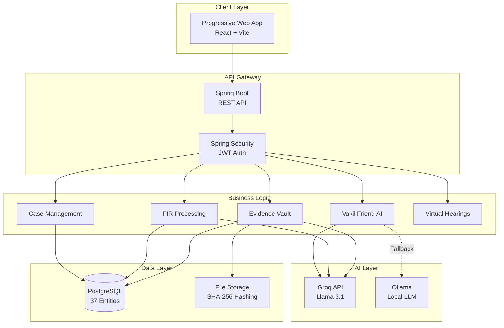
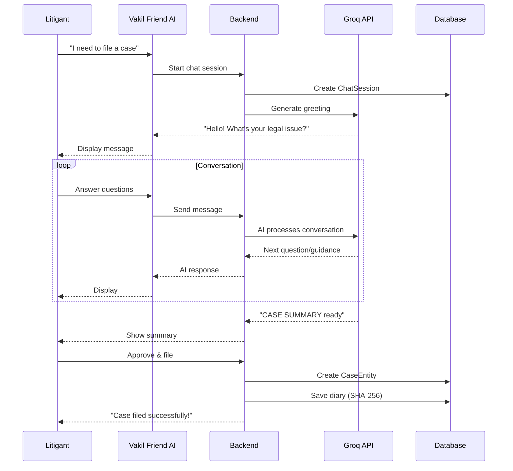

# Nyay Saarthi - Architecture Overview

## High-Level System Architecture

## User Journey: Case Filing with AI

## AI Integration Snapshot

| Feature | Technology | Speed | Privacy |
|---------|------------|-------|---------|
| Vakil Friend | Groq (Llama 3.1 70B) | 150 tok/s | Anonymized |
| Document Analysis | Groq (Llama 3.1 8B) | 200 tok/s | Anonymized |
| Constitution Q&A | Ollama (Local) | 30 tok/s | 100% Private |
| Judge's Brief | Groq (Llama 3.1 70B) | 150 tok/s | Anonymized |

For detailed 26 REST API controllers routing map, role-based access matrix, and database schemas, refer to the root `SYSTEM_DOCUMENTATION.md` and `AI_INTEGRATION_GUIDE.md` files.
